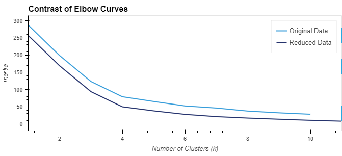
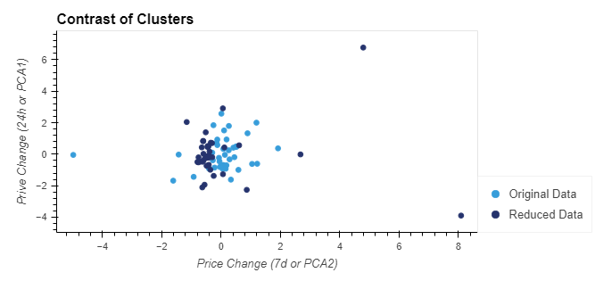

# MOD19-Crypto-Clustering
Student:  Jennifer Grubb  
Instructor:  Steven Greene  
Bootcamp:  DU-VIRT-DATA-PT-06-2023  
07 November 2023  

## Table of Contents
- [About](#about)
- [Contributing](#contributing)
- [Summary](#summary)
  
## About
In this challenge, I use my knowledge of Python and unsupervised learning to predict if cryptocurrencies are affected by 24-hour or 7-day price changes.

## Contributing
N/A  
    
## Summary
In this challenge, we used the original dataset and a reduced dataset (PCA) and compared the elbow curves and cluster plots to see if there were any differences.

The best value of k was 4 for both sets.  

  

The contrast scatter plot shows the Reduced Data has a tighter cluster with a few outlighters.  

  

